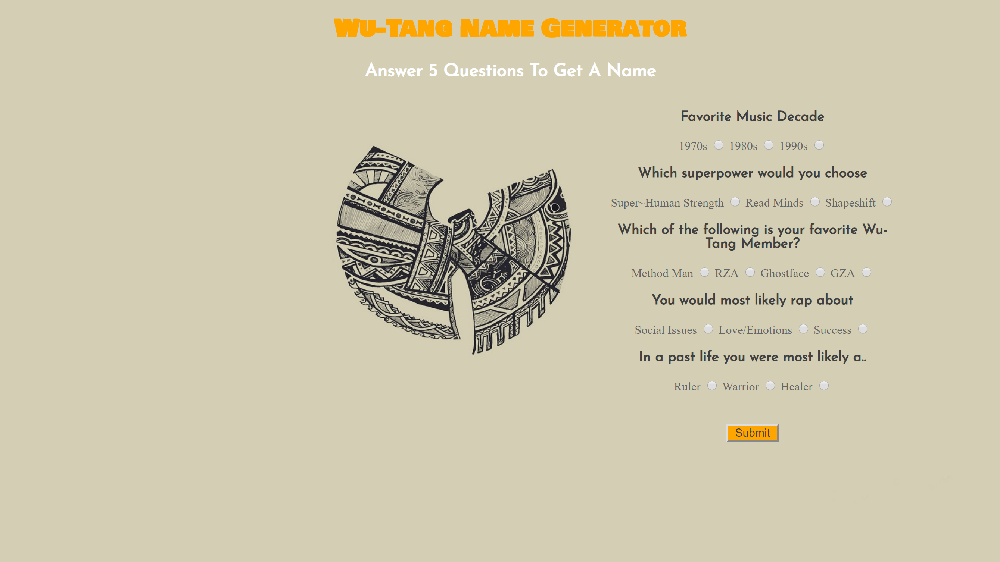

# Wu-Tang Name Generator
This is an application that gives user's their Wu-tang name based off their response to 5 questions asked.

## How It's Made:

**Tech used:** HTML, CSS, JavaScript
When the user submits his answer, a function runs to validate the users answers and then randomly selects a name from two global arrays. Then displays in the DOM the Wu-Tang name of the user's.

#Optimization:

Include a point system for answers selected and then display names for good and bad answers.

## Lessons Learned:

Understand how to pull points from the DOM without having too many if condition statements for points allowed. Still working on developing a more complete Wu-Tang Name Generator.
